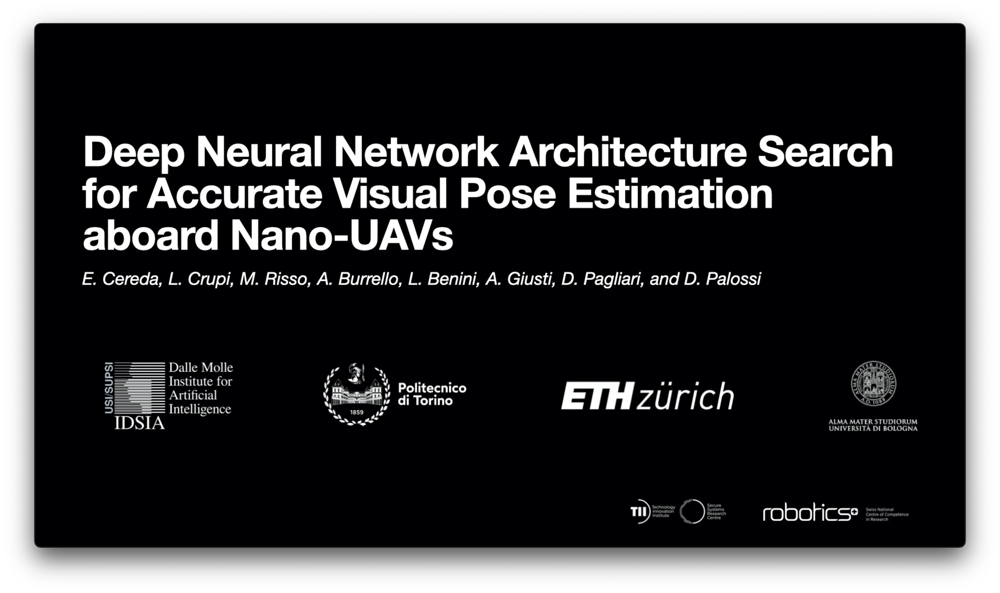

## ICRA'23 2244 — Supplementary video material

Deep Neural Network Architecture Search for Accurate Visual Pose Estimation aboard Nano-UAVs

### Authors
Elia Cereda1,
Luca Crupi2,
Matteo Risso2,
Alessio Burrello3,
Luca Benini3,4,
Alessandro Giusti1,
Daniele Jahier Pagliari2,
Daniele Palossi1,4

1 Dalle Molle Institute for Artificial Intelligence (IDSIA), USI and SUPSI, Lugano, Switzerland. 
2 Department of Control and Computer Engineering, Politecnico di Torino, Turin, Italy. 
3 Department of Electrical, Electronic and Information Engineering, University of Bologna, Bologna, Italy. 
4 Integrated Systems Laboratory (IIS), ETH Zürich, Zürich, Switzerland. 

<a href="https://youtu.be/ELabTJk1RIU">
  <b>In-field experiments video</b>
   
    
</a>
